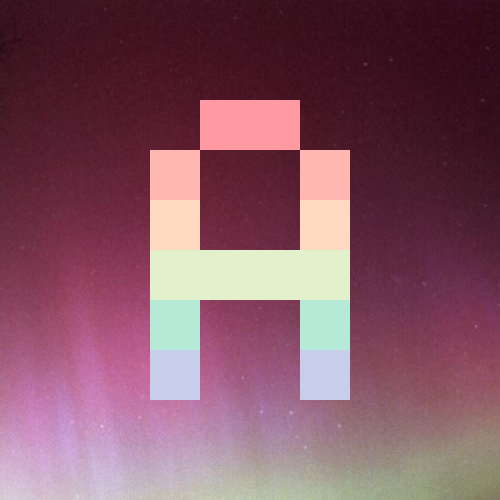

# Aurora Discord Bot
*A community-built Discord bot to provide services in the Minecraft Computer Mods Discord guild.*

Not a member of the guild yet? Join the [Minecraft Computer Mods Discord guild](https://discord.gg/H2UyJXe).


# Development
This Discord bot is built with [node.js](https://nodejs.org/en/) using the [discord.js](https://discord.js.org/#/) framework.

## Repository folder structure
The following folder structure is expected:
- `assets/` - Contains all the assets such as the logo and other media used for the bot.
- `modules/` - Contains all the logic the bot uses such as events and slash-commands, with each file containing seperate functionality.
- `bot.js` - The main file for the bot, which is run to start the bot.
- `deploy_commands.js` - A script for pushing slash-commands to Discord.

## Required software
- You will need **node.js** and **npm**. For a POSIX-compliant environment, I recommend [nvm](https://github.com/nvm-sh/nvm) to install these, if you do not have them already installed.
- A modern IDE such as [Visual Studio Code](https://code.visualstudio.com/) is recommended aswell.

## Setting up
- Clone the repository to your local machine.
- Navigate to the root directory of the repository, and use `npm install` to install the required dependencies automatically.
- Create a Discord application (bot instance) at the [Discord Developer Portal](https://discordapp.com/developers/applications/).
- Invite your bot to a test-guild, and be sure to give the bot the correct scopes and permissions, for example with the following url: `https://discord.com/api/oauth2/authorize?client_id=YOUR_BOT_ID_HERE&permissions=1505587489862&scope=bot%20applications.commands`
- Copy the file `.env.example` to `.env` and fill in the correct values:
  - `DISCORD_BOT_TOKEN` should be the private token of the bot instance you created.
  - `DISCORD_CLIENT_ID` should be the client id of the bot instance you created.
  - `DISCORD_GUILD_ID` should be the guild id of the guild you want to use the bot in.

## Running
If you have not run the bot before OR if you have modified slash-commands, you need to inform Discord of the slash-commands the bot supports. You can do this by running the `deploy_commands.js` script. Simply execute `npm run deploy` in the root directory of the repository.

Then you can start the bot by executing `npm run bot` in the root directory of the repository. The bot should appear online in Discord shortly, and you can try to use it by typing the `/ping` command.


## TL;DR
```sh
npm install # Install dependencies
cp .env.example .env # Setup environment variables
npm run deploy # Register slash-commands
npm run bot # Start the bot
```


# Contributing
To contribute to this bot, please fork the latest `main` branch of this repository. You can now work in your own repository. Once you have finished your work, make sure you've tested it **thouroughly**, and then create a pull request with your changes. We can then review your changes and merge them into the main repository, should they fit.

Do you want to implement a new feature or change an existing feature? To ensure we'll accept and merge your work, please discuss the changes first in the Discord guild. Ask your fellow community members and/or staff members what they think about your proposed modifications in the `#bot` and/or `#meta` channels. Major changes or new features might require community approval via a #proposals proposal, before being added to the bot. Reach out to staff members if you have questions.

Ofcourse you should respect the [MIT License](LICENSE.md) when contributing. Make sure that whatever changes you make can be accepted to our repository under the license, and have your code properly formatted with a linter or code-style checker, like [Prettier](https://prettier.io/). Furthermore, try your best to adhere to discord.js best practices, such as placing logic and functionality in the appropriate files.

Most features or functions should not require any additional npm packages. If you insist on using additional npm packages, please make sure you've discussed them with the community and/or staff members. Packages with a health score less than 75 at [snyk.io advisor](https://snyk.io/advisor/) are not appreciated.

Naturally, all features in the Discord bot must not violate to the Discord terms of service for bots. To ensure this, the bot should not persistently store any user data gathered from Discord.

The maintainers of this repository and the staff of the Minecraft Computer Mods Guild have no obligation to review or accept your proposed changes.

## Docker
There's work being done to allow the bot to be run in a Docker container for production use. This is currently a work in progress. If you're experienced with docker or docker-compose, see the `Dockerfile` and feel free to suggest or PR improvements!

# Licence
This repository and its contents are licenced under the simple and permissive [MIT Licence](LICENSE.md). By contributing to this repository, you agree that your work will also be licenced under the MIT Licence.

